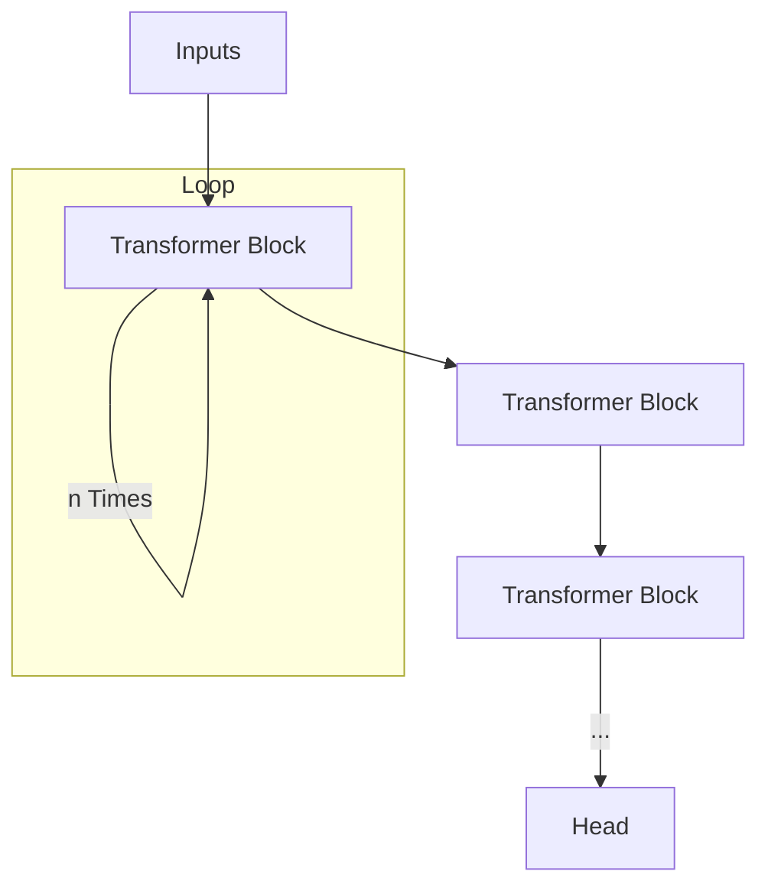

# Ideas for Implementation

## Table of Contents
- [Data Manipulation](#data-manipulation)
  - [Frequency-Aware Masking](#frequency-aware-masking)
- [Architecture and Modelling](#architecture-and-modelling)
  - [Looped Diffusion](#looped-diffusion)
  - [Energy-Based Diffusion Language Models](#energy-based-diffusion-language-models)
  - [Soft Masking Diffusion](#soft-masking-diffusion)

## Data Manipulation

### Frequency-Aware Masking

**Source**: https://arxiv.org/pdf/2509.05056

This is the solution employed in last year's BabyLM diffusion solution. The authors used Frequency-Aware masking. This consists of changing the probability with which tokens are masked to make it more likely for *rare* tokens to be masked.

## Architecture and Modelling

### Looped Diffusion

**Source**: https://arxiv.org/pdf/2605.26106

**Main Idea**

The Authors claim that by "looping" some early or middle layers of the Transformer in diffusion they obtain both a more compute-efficient training loop, and a setup where they can increase performance by changing the number of times the layers are looped at inference time.

During training, the number of loop iterations `n` is drawn at random from `{1, ..., N}` for some predetermined N. At inference time, it is fixed by the user. Larger values of `n` at inference time (even greater than the `N` bound used in training) empirically show better performance.

### Energy-Based Diffusion Language Models

**Source**: https://arxiv.org/pdf/2410.21357

### Soft Masking Diffusion

**Source**: https://arxiv.org/pdf/2510.17206

